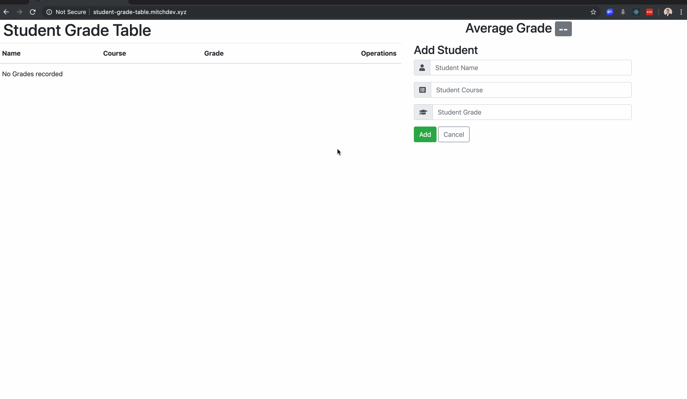

# Student-Grade-Table

A full stack JavaScript CMS application for educators that want to manage student course records.

## Technologies Used

- React.js
- Webpack 4
- Bootstrap 4
- Node.js
- Express.js
- MySQL
- HTML5
- Apache2
- AWS EC2

## Live Demo

Try the application live at [http://student-grade-table.mitchdev.xyz](http://student-grade-table.mitchdev.xyz)

## Features

- Educators can view a list of recorded grades.
- Educators can view the average grade.
- Educators can add a grade to the table.
- Educators can update a grade on the table
- Educators can delete a grade from the table.

## Preview

