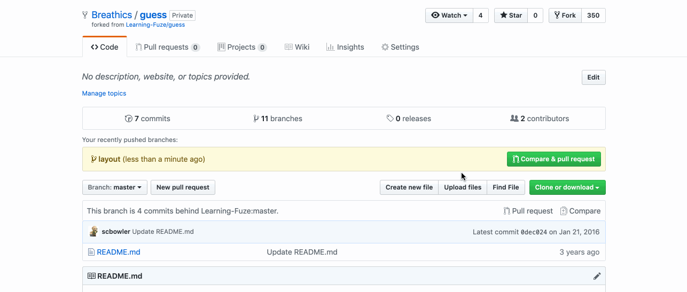
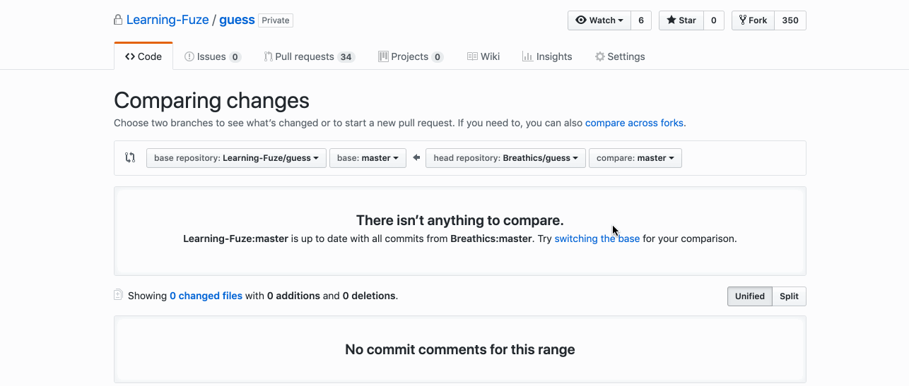
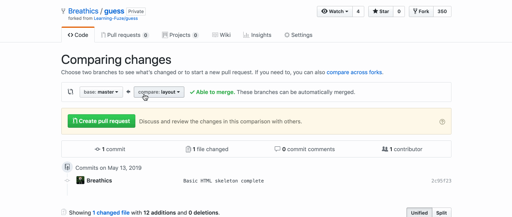
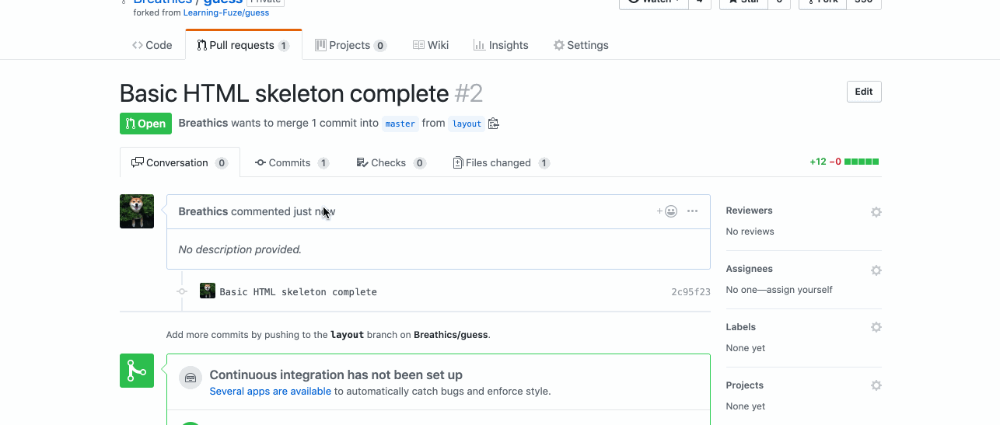

Instructions - Pulling Student Info from Server
--

### Overview

In this feature, You will add the functionality of pulling student info from a server and rendering it on the page.

1. Where to Begin

  - The following will be done in the index.html.
    - Create a third button below the add and cancel buttons
       - This button will be used to retrieve server data

    - Make sure the button fits in with the overall design
    - The button should be labeled "Retrieve Data"
    - When this is complete you will move on to the JS Functionality
  - The Following will be done in the SGT template class
    - Declare a method that will be used to retrieve the student data from the server
      - It takes no paramaters
      - It will send the following data to the server
        - The api key you were given
      - It will return the following from the server
        - An object literal which contains:
          - A boolean on whether the server request was successful
          - The student data if the request was successful
    - Create a click handler in the `addEventHandlers` method that will take the new data retrieval method as a callback
      - test your click handler to make sure your data retrieval method is called correctly
    - In the data retrieval method:
      - Use an AJAX call to the Learning Fuze SGT API to pull all of the student records from the server:
        - Declare an object literal named `ajaxConfigObject`
          - API configuration object information:
            - datatype:
              - Takes the string "json"
            - URL: `http://s-apis.learningfuze.com/sgt/get`
            - method: post
            - data:
              - This key will contain the object you are sending to the server
                - The object will have a single key `api_key`:
                - The value for that key is your api key as a string
            - success:
              - Callback function that will run if your api call is successful
              - Remember that success comes in two types
                - You contact the server and get the data you were requesting
                - You contact the server, but there is an error of some kind that prevents you from receiving what you requested
                - Always check the server response so that you know whether or not your request was truly successful or if you simply made contact with the server
            - error:
              - Callback function that is called when there is an error contacting the server
        - Note the different ways of attaching success and error callbacks to your AJAX call
          - Documentation: [AJAX Callbacks](http://www.binaryintellect.net/articles/749ed588-b408-4a7e-94da-77549c00e803.aspx)
          - You can use either the local callbacks or promise callbacks for this project
            - note the global callbacks, but do not use them!
      - Once you are receiving the requested data from the server:
        - perform the following in your `success` callback
          - Create a student object for each of the students in the reaponse object and store them in `this.data`
            - Remember that you have a method to create students...
              - It may require modification
              - Note the order at which you pass the paramaters into it when calling it
            - Note the IDs that accompany each student
              - You will no longer be generating IDs for students
                - This is the DB's job
              - This information will be used in later operations
                - Deleting Students
                - Updating Students
          - Call your `displayAllStudents` method to update the DOM with the new student objects you created with the data that you received from the server
      - Congrats! You have completed this Feature Set

### After Each Feature

- When your feature implementation is complete, you will want to save and submit your work to the branch that you have created.
  - Use `git status` to check that you are on the correct branch that represents your feature.
  - You will want to **add**, **commit**, and **push** the code that you have written to the appropriate Github repository.
    1. `git add .`
    2. `git commit -m "Description of the feature that you have implemented"`
       - e.g. `git commit -m "added retrieve server data functionality"`
    3. `git push origin FEATURE_NAME_HERE`
       - e.g. `git push origin get-student-data`

- Finally, you will want to create a pull request. This will merge the code from your newly **completed** feature branch into your `master` branch.

  1. Navigate to <kbd>New Pull Request</kbd>:
  
  2. Compare changes to merge:
  
  3. Create a new pull request:
  
  4. Merge pull request:
  
  5. Update master with the new changes:
  
  6. Go back to [Features](../../README.md#features), if you're still working through the project.
