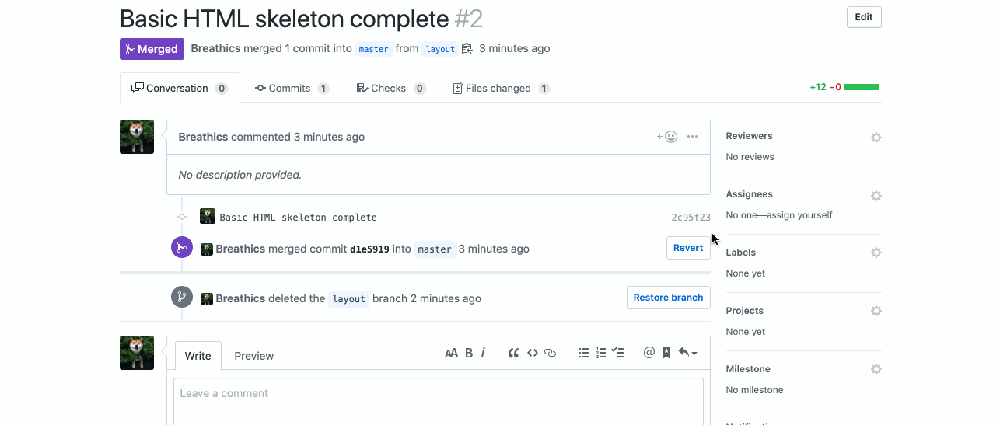

Instructions - Calculation of stored values
--

### Overview

In this feature, you will complete the functionality of the SGT template.

1. Where to Begin 

  - As in the previous Feature Set:
    - Make sure to familiarize yourself with:
      - What paramaters the constructor receives, if any.
      - What methods the object will have when the build out is complete
      - What data, if any, the methods will recieve
      - What the methods will return
    - Once you have familiarized yourself with the code
      - Begin working in the constructor
       - Construct it according to the documentation
        - Note the errors returned by the tests
          - As before, they will let you know what needs to be done
        - Be aware that you might have to update the code in your `student.js` file
    - When you have completed all of the tests, congratulations!!! you are ready to move on to the next feature set!

### After Each Feature

- When your feature implementation is complete, you will want to save and submit your work to the branch that you have created.
  - Use `git status` to check that you are on the correct branch that represents your feature.
  - You will want to **add**, **commit**, and **push** the code that you have written to the appropriate Github repository.
    1. `git add .`
    2. `git commit -m "Description of the feature that you have implemented"`
       - e.g. `git commit -m "completed initial build of SGT object"`
    3. `git push origin FEATURE_NAME_HERE`
       - e.g. `git push origin sgt-object`

- Finally, you will want to create a pull request. This will merge the code from your newly **completed** feature branch into your `master` branch.

  1. Navigate to <kbd>New Pull Request</kbd>:
  
  2. Compare changes to merge:
  
  3. Create a new pull request:
  
  4. Merge pull request:
  
  5. Update master with the new changes:
  
  6. Go back to [Features](../../README.md#features), if you're still working through the project.
